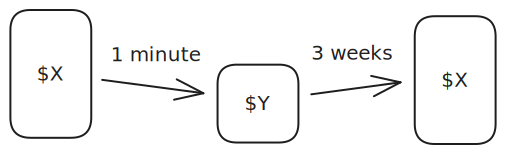

# The dreaded "I'll foot the bill"
In a [catchup culture](catchup-culture) like mine, it is inevitable that you will find yourself footing a shared bill. You have to find the money from somewhere (since it might be more than you've got to spend for the week), but it is only as a short term loan before your friends pay you back.

It's much better to pay for big things from a bank account that has plenty of buffer room (for instance the one that pays rent) so it can absorb it. What sucks is that you are less cognizant of the small ins and outs in an account like that so it can be hard to follow up on.

A solution is to have an account purely for loans. You should know exactly how much is in this account (e.g. $1000). Next time you are the legend who got through on a music festival waiting list, you can just transfer the money easily.

This then lets you immediately tell if you have overdue loans - just eyeball your loans account and if it's below the desired "$X". 

You should also 'pay yourself' back, i.e. pretend you are one of your friends! This way you get the wheels rolling on paying back. I also recommend setting up [PayID](https://payid.com.au/) so it is easy to allow friends to pay back in a timely way.

I think of this "loans" account like [decoupling capacitors](https://en.wikipedia.org/wiki/Decoupling_capacitor) on a circuit board. They provide a little extra juice (in this case cash) when the device (you) need it. This is then filled back up as people pay it back and it's obvious when it's fully "charged".